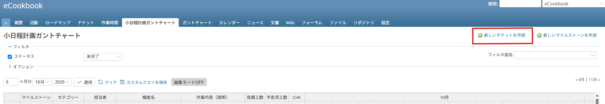
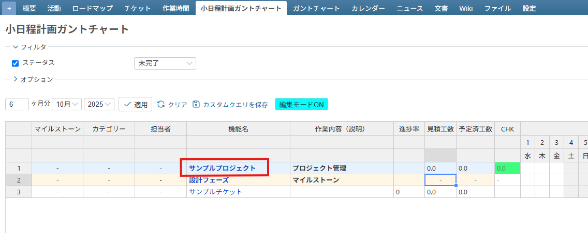
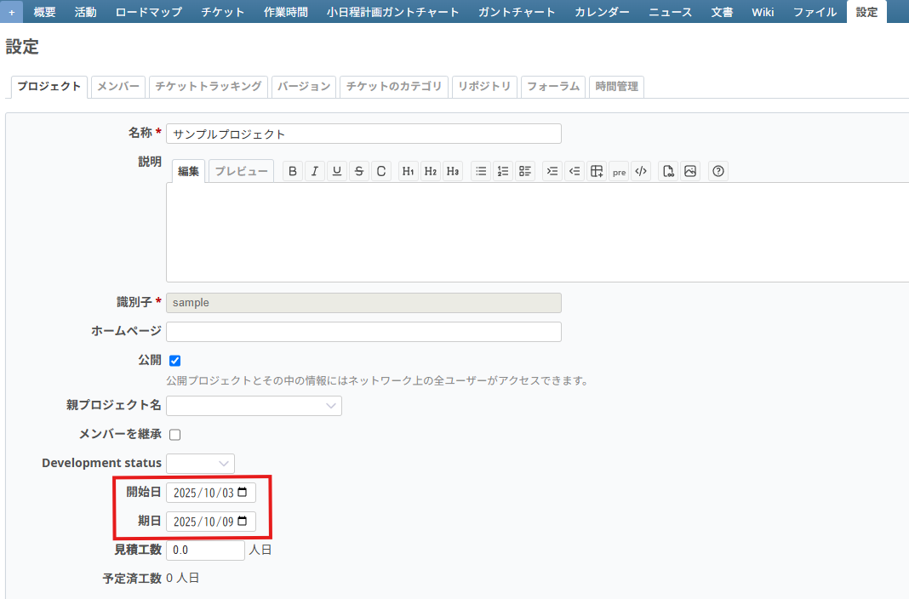
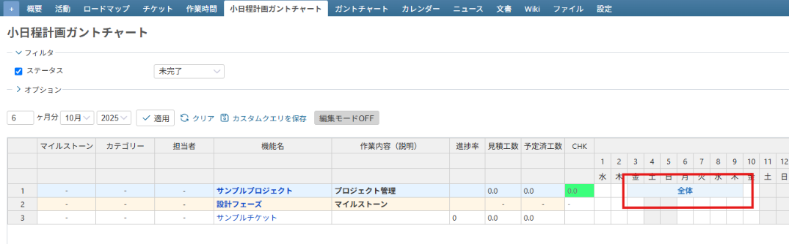
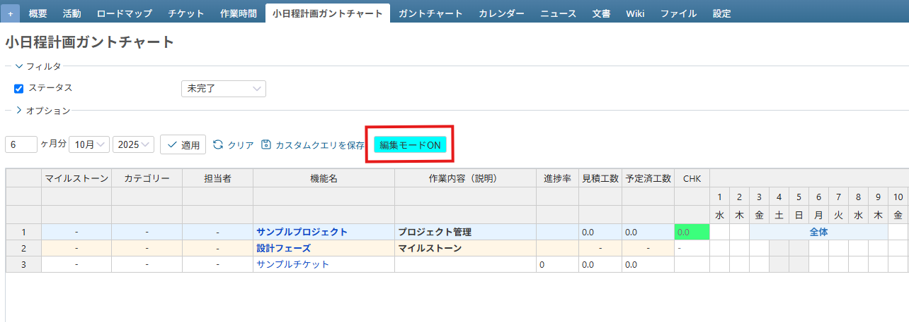
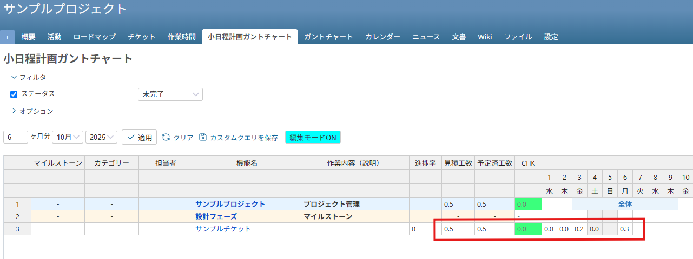

# 小日程計画ガントチャートプラグイン

## プラグインの概要

- Redmine Detailed Schedule Gantt Plugin は、Redmine における「**小日程計画（詳細スケジュール）**」のガントチャートプラグインです
- エクセルのようなグリッド形式のため、タスクの作成・変更・進捗管理を簡単に行うことができます
- 小日程計画のため、その日に誰が何をどのくらい作業するかの予定を組むことができ、正確な予実管理が可能になります

## 機能一覧
- 小日程計画粒度のガントチャート機能
- ガントチャート上でのチケット内容編集機能（エクセル感覚でチケット登録/編集が早い！→スケジュール管理が楽）
- 担当者に割り当てられた1日の合計工数チェック機能（全プロジェクトから担当者ごとに集計！→再現性の高い予定が可能）
- 見積工数と予定済工数のチェック機能（プロジェクト単位、チケット単位→予算を意識したPJ管理が可能）
- プロジェクト全体工数管理機能
- マイルストーン管理機能
- 排他制御機能
  ... and more

## プラグインの使用方法
1. ソースードを Redmine の plugins 配下に配置する  
   `/app/plugins/redmine_detailed_schedule_gantt`

2. マイグレートファイルを実行する  
   `bundle exec rake redmine:plugins:migrate`

3. このプラグインを使いたいプロジェクトの設定画面で有効化する  
   `参考URL：/projects/[プロジェクト識別子]/settings`

4. モジュール欄に「小日程計画ガントチャート」チェックボックスが追加されるのでチェックする

5. 管理メニューにある「ロールと権限」から権限を付与したいロールをクリックして「スプレッドシートの閲覧」と「スプレッドシートの更新」にチェックを付けて保存する

6. プロジェクト内のタブに「小日程計画ガントチャート」タブが表示されるようになるのでクリックする

- マイグレーションをロールバックする方法。アンインストールする際等に使用  
  `bundle exec rake redmine:plugins:migrate NAME=redmine_detailed_schedule_gantt VERSION=0`

## チュートリアル
0. 既にプロジェクトとチケットが作成されている場合はすぐに小日程計画が立てられます 4. に進んでください

1. プロジェクトを作成する
[プロジェクト作成](https://redmine.jp/tech_note/first-step/admin/create-project/ "プロジェクトの作成方法")

2. プロジェクトにメンバーを追加する
[プロジェクトにメンバーを追加する](https://redmine.jp/tech_note/first-step/admin/add-project-member/ "プロジェクトにメンバーを追加する方法")

3. チケットを作成する

4. プロジェクトに全体スケジュールを設定する

    - 機能名列、1行目のリンク（サンプルプロジェクトの部分）をクリックする

    - 開始日と期日と見積工数（人日）を設定する

      ※見積工数にプロジェクトの見積の総工数を設定する

    - 開始日と期日に設定した期間がセルに表示される

5. 編集モードをONにする
    - 画面が読み込まれただけではセルの値を書き換えられません。書き換えるためには編集モードボタンをクリックしてONとOFFを切り替える必要があります
    ガントチャート内の入力値の保存は、カーソルがセルから離れるたびに保存されます。そのため、最後に編集したセルからカーソルを離さずに他のページに移動すると変更は失われてしまいます
    - 最後に編集したセルからクリックでもエンターでも構わないのでカーソルを移動させる必要があります

6. チケットの予実管理をする
    - 見積工数に対象タスクの見積工数を入力する
    - スケジュール欄にてその日に実施する予定工数（人日）を入力する
    - 予定済工数に、日付セルに入力された値の合計値が自動計算されます
    - CHK欄に、見積工数と予定済工数の差が表示され、割当状況がチェックできます  
      ※予定済工数が見積工数より増えれば見積ミス or 管理ミスと判断できます  
      ※プロジェクト管理も同様に、見積工数と予定済工数のチェックができます  
    - 実績は進捗率欄に進捗率を入力して管理します  
      ※当ガントチャートは予定重視の管理手法となります  
      ※状況を常に反映して、実現性・再現性のあるスケジュールに随時変更してください  

---

## License & Contact

Copyright (c) 2025 ストラクチュアルライン株式会社 / Structural Line Incorporated  
SPDX-License-Identifier: GPL-2.0-or-later  
Company website: [https://sl-inc.co.jp](https://sl-inc.co.jp)

For bug reports or inquiries, please contact: 
**rp-rdsg-support@sl-inc.co.jp**

For project management consulting or collaboration inquiries, please contact:
**info@sl-inc.co.jp**